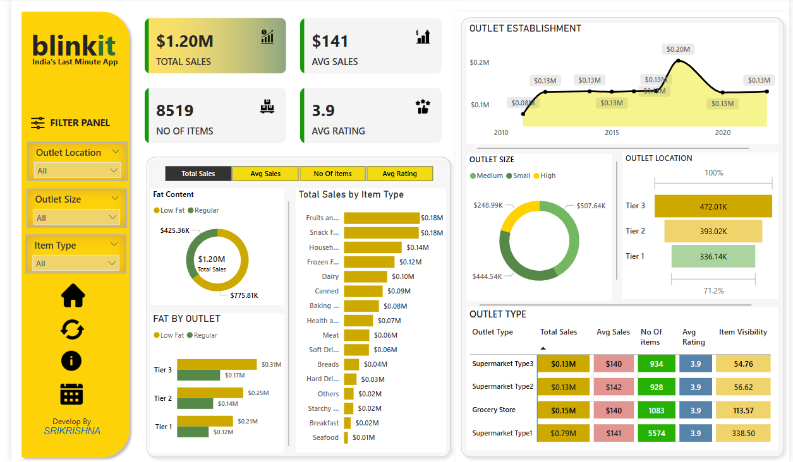

# 🛍️ Blinkit Sales Dashboard

An interactive and visually engaging Power BI dashboard designed for **Blinkit – India’s Last Minute App**. This report provides deep insights into sales performance, customer engagement, item distribution, and outlet dynamics across multiple locations.

---

## 📊 Key Insights Provided

- 💰 **Total Sales**: $1.20M across all outlets and item categories.
- 📦 **Total Items Sold**: 8,519 items with an average sale value of $141.
- ⭐ **Customer Rating**: 3.9 average rating across all items and outlet types.
- 🧈 **Fat Content Sales**: Comparison of low-fat vs regular-fat items.
- 🧾 **Top-Selling Item Categories**: Fruits, Snacks, Household, Frozen, etc.
- 🏬 **Outlet Insights**:
  - Location Tiers: Tier 1, Tier 2, Tier 3
  - Outlet Types: Supermarkets (Type 1-3), Grocery Stores
  - Outlet Size: Small, Medium, High
- 📈 **Outlet Establishment Trends**: Sales performance over time (2010–2023).
- 🎛️ **Dynamic Filters**:
  - Outlet Location
  - Outlet Size
  - Item Type

---

## 🛠️ Built With

- **Power BI Desktop** – For building interactive dashboards
- **DAX** – Custom measures and calculated columns
- **Microsoft Excel/CSV** – Used as the base data source

---

## 📁 Folder Structure

Blinkit-Dashboard/
├── Blinkit_Dashboard.pbix             # Power BI dashboard file
├── BlinkitDashboard.png               # Dashboard screenshot for README
├── README.md                          # Project documentation
└── data/
    └── sales_data.csv                 # Raw dataset used for analysis
---

## 📈 Use Case

This dashboard can be used by:
- Business analysts for sales tracking and outlet performance
- Marketing teams to understand product preferences
- Management to identify high-performing outlet types and areas

---

## 🧑‍💻 Developed By

**SRIKRISHNA**  
Passionate about data visualization and business intelligence.

---

## 🌟 Show Some Love

If you found this project helpful, feel free to ⭐ star the repository and share your feedback!

---

## 📬 Contact

[LinkedIn Profile](https://www.linkedin.com/in/srikrishna-paul/) 
Email: srikrishnapaul95@gmail.com
